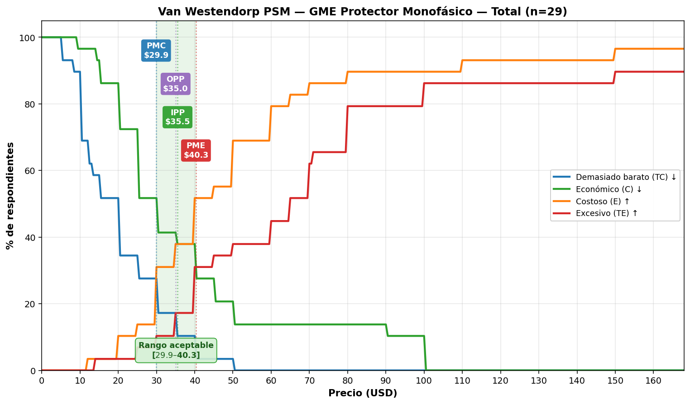
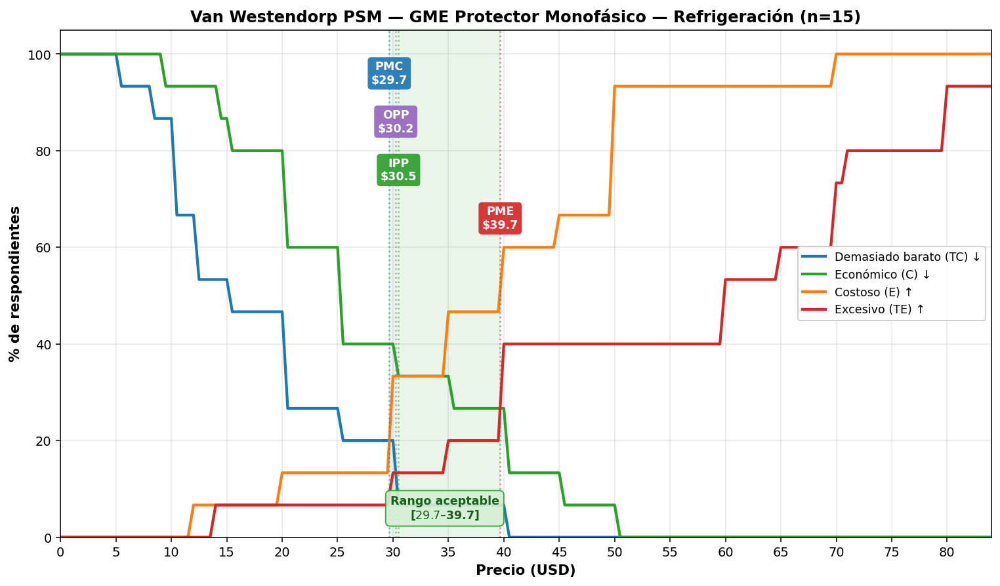

# Informe Van Westendorp PSM — GME Protector Monofásico

**Fuente**: Encuesta on-line a comunidad Exceline Profesional, abril–mayo 2026
**Muestra**: 32 respuestas, **29 completas** y válidas para análisis de precio
**Aplicaciones cubiertas**: Motores (n=8), Bombas (n=6), Refrigeración (n=15)
**Curvas**: ver `van_westendorp/vw_total.png`, `vw_motores.png`, `vw_bombas.png`, `vw_refrigeracion.png`
**Resumen JSON**: `van_westendorp/vw_summary.json`
**Fecha de análisis**: 2026-05-06

---

## 1. Resumen ejecutivo

La metodología Van Westendorp aplicada a las 4 preguntas de precio de la encuesta arroja un **rango aceptable global de USD 29.90 – 40.33** con **precio óptimo (OPP) en USD 35.00** y **precio de indiferencia (IPP) en USD 35.50**.

**Recomendación principal**: precio **lista USD 35** para el producto base, con **techo USD 40** antes de comprometer aceptación en el segmento más grande (Refrigeración). Por debajo de **USD 30** hay riesgo de desconfianza por percepción de baja calidad.

| Segmento | n | Mín. (PMC) | Optimal (OPP) | Indifference (IPP) | Máx. (PME) | Rango aceptable |
|---|---:|---:|---:|---:|---:|---|
| **Total** | 29 | $29.90 | **$35.00** | $35.50 | $40.33 | $29.90 – $40.33 |
| Motores | 8 | $35.25 | $35.50 | $40.50 | $45.50 | $35.25 – $45.50 |
| Bombas | 6 | $30.00 | $30.50 | $40.00 | $50.00 | $30.00 – $50.00 |
| Refrigeración | 15 | $29.67 | $30.25 | $30.50 | $39.67 | $29.67 – $39.67 |

> **Lectura crítica**: Refrigeración es 52% de la muestra y es el segmento más sensible al precio (techo en $40). Motores tolera el precio más alto ($45.50 techo). Bombas presenta el rango más ancho (hasta $50) pero con n=6 la confianza estadística es limitada.

---

## 2. Metodología

Van Westendorp Price Sensitivity Meter (1976) usa 4 preguntas:

| Q | Pregunta | Curva | Dirección |
|---|---|---|---|
| Q10 | "¿A cuál precio le parece TAN BARATO que no confiaría en su calidad?" | **TC** Demasiado barato | Descendente |
| Q11 | "¿A cuál precio le parece económico y confiable?" | **C** Económico | Descendente |
| Q12 | "¿A cuál precio le parece costoso pero aún lo compraría?" | **E** Costoso | Ascendente |
| Q13 | "¿A cuál precio le parece excesivamente costoso que NO lo compraría?" | **TE** Excesivo | Ascendente |

A partir de la distribución acumulada se identifican **4 puntos clave** por intersección de curvas:

| Punto | Definición | Intersección | Lectura |
|---|---|---|---|
| **PMC** Point of Marginal Cheapness | Cota inferior del rango aceptable | TC ∩ E | Por debajo, dudas de calidad dominan |
| **OPP** Optimal Price Point | Punto de menor resistencia psicológica | TC ∩ TE | Igual % de "demasiado barato" que de "excesivo" |
| **IPP** Indifference Price Point | Precio "justo" para el promedio | C ∩ E | Igual % piensa "económico" que "costoso" |
| **PME** Point of Marginal Expensiveness | Cota superior del rango aceptable | C ∩ TE | Por encima, percepción de inasequible domina |

**Rango aceptable de precios (RAP)** = [PMC, PME].

---

## 3. Resultados por segmento

### 3.1 Total (n=29)

- **PMC** $29.9 — **OPP** $35.0 — **IPP** $35.5 — **PME** $40.3
- Rango aceptable estrecho (~$10) y consistente: **OPP e IPP casi coinciden**, lo que indica un mercado con expectativa de precio madura y poco dispersa para el producto descrito.
- Outliers extremos en TE ($200, $300) inflan la media pero no afectan los puntos clave (la mediana TE es $65).

### 3.2 Motores (n=8)

- **PMC** $35.3 — **OPP** $35.5 — **IPP** $40.5 — **PME** $45.5
- **Tolerancia a precio más alta** del estudio. PMC alto ($35) implica que precios <$35 generarían dudas de calidad en este segmento.
- Coherente con que la protección de motores trifásicos/grandes capacidades suele tener equipos comparables más caros.

### 3.3 Bombas (n=6)

- **PMC** $30.0 — **OPP** $30.5 — **IPP** $40.0 — **PME** $50.0
- Rango más ancho (hasta $50) pero **n=6 es muy bajo**, los intervalos de confianza son amplios. Tomar como direccional.
- OPP e IPP separados $9.50 sugieren dispersión de expectativas (algunos técnicos lo ven como producto premium, otros como commodity).

### 3.4 Refrigeración (n=15)

- **PMC** $29.7 — **OPP** $30.2 — **IPP** $30.5 — **PME** $39.7
- **Segmento más sensible al precio** y con mayor peso en la muestra (52%).
- **Los tres puntos centrales (PMC, OPP, IPP) están en una franja de $1**, lo que apunta a una expectativa muy cristalizada de precio "justo" cercana a $30.
- Techo $40 estricto: por encima, riesgo claro de pérdida de aceptación en este segmento.

---

## 4. Recomendaciones de precio

### Escenario A — SKU único o pricing transversal (recomendado)

Si el producto se vende a precio único independiente de la aplicación seleccionada (caso probable si el hardware es el mismo y solo cambia firmware/etiqueta), **el target es USD 35 lista** porque:

- Cae dentro del rango aceptable de los **3 segmentos simultáneamente** (Motores 35.25–45.50, Bombas 30–50, Refrigeración 29.67–39.67).
- Coincide con OPP e IPP del Total (mínima resistencia psicológica + mediana de "precio justo").
- Deja **headroom de $5** antes del techo de Refrigeración (segmento dominante en la muestra) — útil para descuentos comerciales o promociones de lanzamiento.

> **Banda operativa sugerida**: precio lista **$35** | floor $30 | ceiling $40.

### Escenario B — Pricing diferenciado por aplicación

Si comercialmente se decide diferenciar (3 SKUs físicos o pricing por canal/aplicación):

| Aplicación | Target sugerido | Justificación |
|---|---:|---|
| Refrigeración (R) | **$30** | OPP/IPP del segmento; sobre PMC; bajo PME |
| Bombas (B) | **$32 – 35** | Cerca de OPP; aprovecha tolerancia |
| Motores (M) | **$38 – 40** | Cerca de IPP; usa la tolerancia premium del segmento |

> **Riesgo**: pricing diferenciado por aplicación cuando el hardware es el mismo es difícil de defender ante distribuidores y técnicos comunicados entre sí. Solo viable si se diferencia visiblemente (empaque, accesorios, certificaciones específicas por uso).

### Escenario C — Posicionamiento agresivo (penetración)

Precio lista **USD 28 – 30**: maximiza adopción rápida, expande TAM hacia el segmento más sensible (Refrigeración mediana $25 económico). Riesgo: parte de la muestra ($28–30) cae en zona TC para Motores y entra en sospecha de calidad. Solo recomendable si:
- Hay claim de calidad muy fuerte (certificación, garantía, marca consolidada Exceline).
- Costo BOM permite margen.
- Estrategia de captura rápida de cuota antes de respuesta competitiva (ej: si GME competidor amenaza con lanzamiento similar).

### Escenario D — Posicionamiento premium

Precio lista **USD 45 – 50**: solo viable si:
- Producto se diferencia con claims fuertes (conectividad robusta verificada, NFC, app validada, garantía extendida, integraciones con BMS).
- Se acepta perder aceptación significativa en Refrigeración ($45+ está fuera de PME).
- Hay justificación de costo / margen que requiera ese precio.

---

## 5. Cruces necesarios antes de cerrar precio

El análisis VW mide **percepción**, no demanda real ni viabilidad económica. Antes de fijar precio:

1. **Costo BOM + margen objetivo**: ¿el precio sugerido cubre costo + margen distribuidor + margen Exceline?
2. **Precio del comparable interno** (otro producto Exceline análogo, ej. GSC-CR): ¿ancla competitiva?
3. **Precio del competidor GME** (cuando se materialice — caso Genteca tracking pendiente para Orlan): ¿posicionarse arriba/abajo/igual?
4. **Estrategia de canal**: si distribuidor toma 30–40% de margen, el precio público puede ser hasta $50 con costo de fábrica ~$25–30.
5. **Pricing por geografía**: la encuesta es predominantemente VE; precios para mercados con mayor poder adquisitivo (EE.UU., Caribe) pueden ser sustancialmente mayores.

---

## 6. Riesgos y caveats

| Riesgo | Implicación | Mitigación |
|---|---|---|
| **Muestra pequeña por segmento** (Bombas n=6, Motores n=8) | Intervalos de confianza amplios; resultados direccionales | Tomar Total como ancla principal; segmentos como modulación |
| **Refrigeración pesa 52%** | Promedio Total sesgado hacia segmento más price-sensitive | Si el mix real de ventas es distinto, recalcular ponderado |
| **VW mide percepción, no demanda** | El "precio aceptable" no garantiza ventas | Cruzar con Conjoint, A/B real o pricing experiments en lanzamiento |
| **Sin ancla competitiva en encuesta** | Técnicos respondieron sin ver precio referencia | Si compradores reales ven referencia (GME competidor, GSC-CR Exceline), las respuestas pueden cambiar |
| **Comentarios sugieren "expectativa anti-inflación"** | Técnico cita ESP32 a $10 como benchmark; expectativa de que conectividad NO suba precio | Si se va arriba de $40, tener guion de defensa de valor (claims técnicos verificables) |
| **Sin pregunta de intención de compra ligada al precio** | No hay validación cruzada PSM con compra | Considerar Newton-Miller-Smith (NMS) extensión si se relanza la encuesta |
| **Outliers extremos** (TE de $200 y $300) | No afectan puntos clave (basados en mediana de cruce) pero indican muestra heterogénea en sofisticación | Validar quiénes son los respondientes — pueden ser técnicos de instalaciones industriales grandes |
| **Encuesta self-report** | Sesgo de deseabilidad social posible | Triangular con datos reales de venta cuando estén disponibles |

---

## 7. Próximos pasos sugeridos

1. **Cruce con costos** (Owner / Producto): obtener costo objetivo y margen de canal para confirmar que $35 cubre estructura.
2. **Cruce con competidor GME** (Orlan OL-3 innovation radar): cuando haya datos del producto competidor referenciado por Raul, ajustar posicionamiento.
3. **Validación con Vera** (técnico): los comentarios abiertos piden features (multivoltaje 120/220, sensibilidad <1s, picos de arranque, historial de fallas con timestamp). Determinar cuáles son alcanzables en lanzamiento — afectan el "claim de valor" que justifica el precio.
4. **Brief Vael** (mensaje): traducir hallazgos VW + 83% preferencia pantalla B en arquitectura de mensaje del lanzamiento. Especialmente: cómo defender el precio ante el comentario tipo-ESP32.
5. **Gate Bruna** (claims): cualquier afirmación tipo "primer protector con monitoreo remoto en este rango de precio" requiere validación de claim antes de uso público.
6. **Considerar segunda ola**: si el lanzamiento permite delay, una segunda encuesta con (a) mayor n por segmento, (b) ancla de precio competidor visible, (c) randomización de orden A/B, daría confianza sustancialmente mayor.

---

## Supuestos y límites

- **Supuesto 1**: las 4 preguntas de Van Westendorp se entendieron por todos los técnicos como referidas al mismo producto (Pantalla B, la que la mayoría prefirió). Si algún subgrupo respondió pensando en la pantalla A más simple, los precios serían sub-estimaciones del valor real percibido del producto B.
- **Supuesto 2**: los precios reportados son en USD reales (la pregunta lo especifica explícitamente "EXPRESE EL MONTO EN DOLARES"). Si algún respondiente confundió bolívares u otra moneda, hay ruido.
- **Supuesto 3**: el "precio" se interpreta como precio al cliente final (técnico/instalador comprando para revender o instalar). No queda explícito si están pensando en precio de fábrica, distribuidor o público.
- **Límite 1**: no hay variable demográfica útil más allá de aplicación seleccionada (ciudad y email se capturaron pero no se usaron para segmentar).
- **Límite 2**: este análisis no incorpora elasticidad-precio real ni intención de compra; solo aceptación psicológica.
- **Límite 3**: las recomendaciones de pricing son **input para decisión de producto/Owner**, no decisión final. No reemplazan análisis de costos, estrategia comercial ni gates de Vael/Bruna.

---

*Análisis ejecutado con `_van_westendorp.py`. Curvas en `van_westendorp/`. Datos fuente: `DATA FINAL Pantallas GME.xls.xlsx`.*
